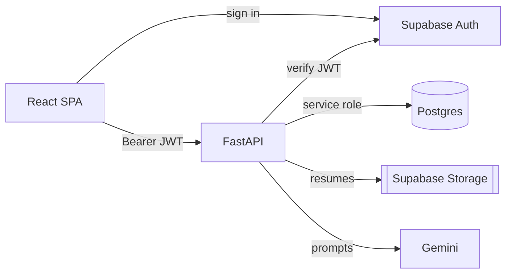
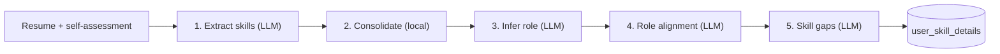
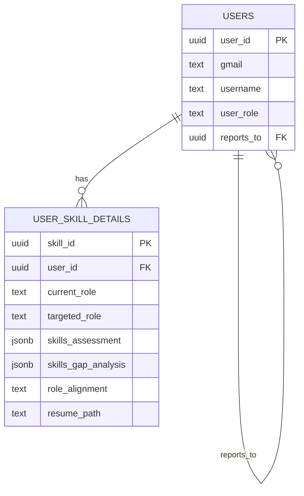

# Architecture

## System



## Analysis pipeline — `POST /api/v1/skill-analysis`



## Data model



- `skills_assessment` → `{ "Java": 8 }`
- `skills_gap_analysis` → `[{ "skill": "SQL", "requiredLevel": 10 }]`

## RBAC

Enforced in `core/auth.py` (`get_current_user` + `require_roles`).

- **Admin** — creates Managers/Employees
- **Manager** — creates own Employees + runs analysis
- **Employee** — runs analysis

## Layout

```
backend/app/   main.py · api/ · core/ · schemas/ · services/
frontend/src/  App.jsx · pages/ · components/ · hooks/ · services/ · constants/
```
