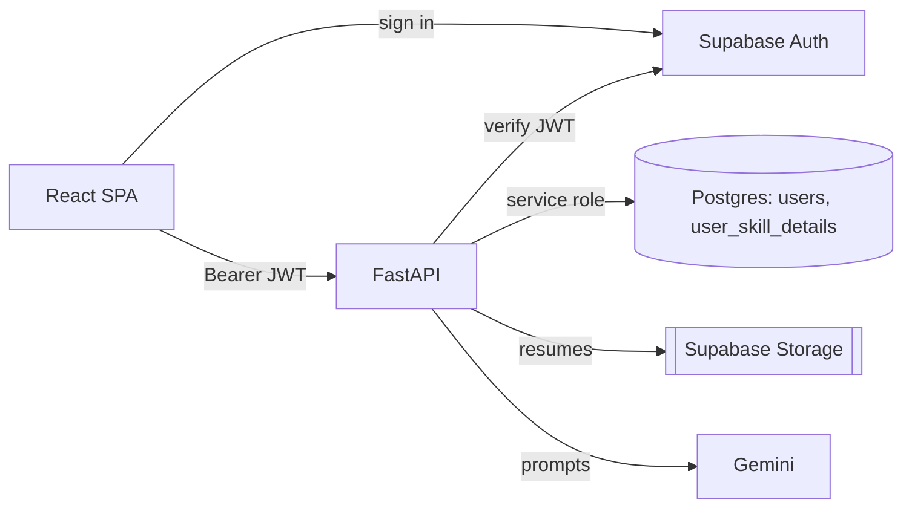
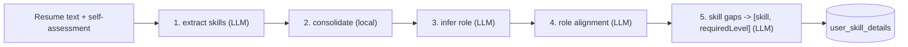
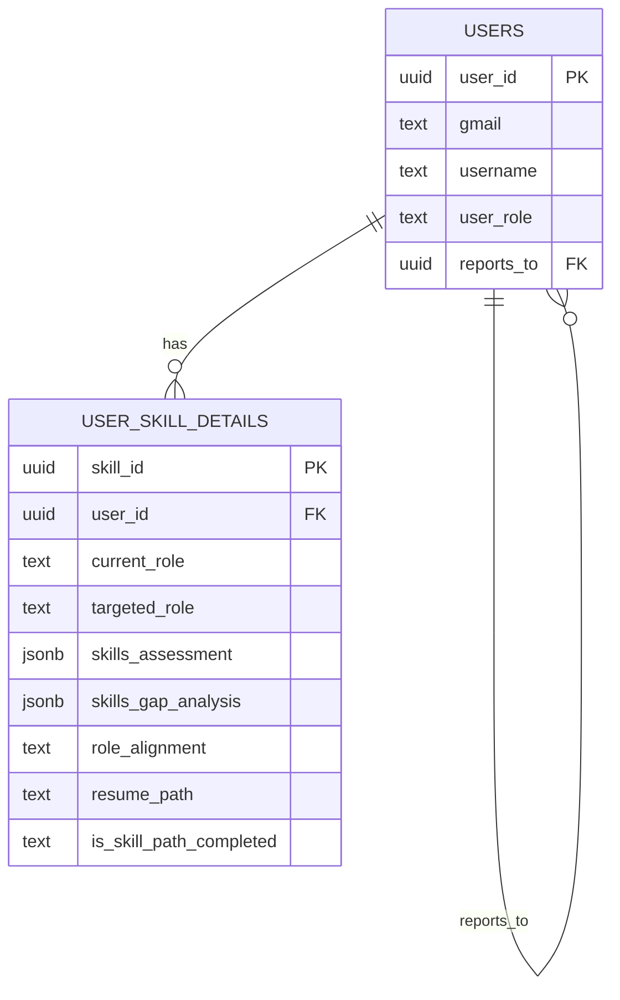

# Architecture — AI-Tutor (Employee Skill Profiler)

Role-based platform. Managers/employees upload a resume + self-assessment;
Google Gemini extracts skills, infers role, checks alignment, and computes skill
gaps vs a target role. Admins manage users.

**Stack:** React + Vite (SPA) · FastAPI · Supabase (Postgres + Auth + Storage) ·
Gemini (`gemini-2.5-flash`).

## System



## Analysis flow — `POST /api/v1/skill-analysis`

`gemini_service.run_full_analysis()`: parse resume → 5-stage pipeline → persist.



Role inference is internal — it only feeds the alignment check and is not stored.

## Data model

Backend uses the Supabase service-role key (bypasses RLS).



- `skills_assessment` → `{ "Java": 8 }`
- `skills_gap_analysis` → `[ { "skill": "SQL", "requiredLevel": 10 } ]`

## RBAC

Admin → creates Managers/Employees · Manager → creates own Employees + runs
analysis · Employee → runs analysis. Enforced in `core/auth.py`
(`get_current_user` + `require_roles`).

## Layout

```
backend/app/   main.py · api/(skills,users) · core/(auth,config,constants,supabase_client)
               · schemas/ · services/(gemini,resume_parser,storage,user,db,seed)
frontend/src/  App.jsx · pages/ · components/(ui,layout,users,skills) · hooks/ · services/ · constants/
```
