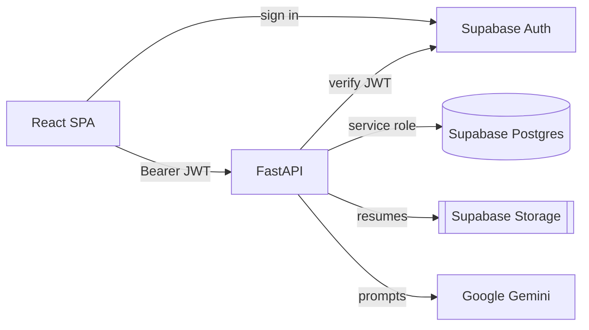

# AI-Tutor — Employee Skill Profiler

Role-based skill-intelligence platform. Managers/employees upload a resume and
self-assess; Google Gemini extracts skills, checks role alignment, and computes
skill gaps vs a target role. Admins manage users.

**Stack:** React + Vite · FastAPI · Supabase (Postgres + Auth + Storage) · Gemini
(`gemini-2.5-flash`).
**Hosting:** Vercel (frontend) · Render (backend) · Supabase · Google Gemini.

See [ARCHITECTURE.md](ARCHITECTURE.md) for diagrams and [BUILD.md](BUILD.md) for run/stop commands.

## Architecture



## Roles

| Capability | Admin | Manager | Employee |
|---|:--:|:--:|:--:|
| Create managers | ✅ | — | — |
| Create employees | ✅ | ✅ (auto-report) | — |
| Delete users | ✅ | own reports | — |
| Run skill analysis | — | ✅ | ✅ |
| Edit own username / password | ✅ | ✅ | ✅ |

## How it works

1. First boot seeds an Admin from `SEED_ADMIN_EMAIL` / `SEED_ADMIN_PASSWORD` (idempotent).
2. Admin/Managers create users (password defaults to `123456` if left blank).
3. Managers/Employees run **Learning Paths → New Analysis** (Resume → Roles → Self-assessment → Review).
4. Backend parses the resume and runs a 5-stage Gemini pipeline (extract → consolidate → infer role → align → gaps), stores the resume, and saves results to `user_skill_details`.
5. Skill gaps are stored as `[{ "skill": "SQL", "requiredLevel": 10 }]` (target proficiency needed).

## Quick start

**1. Supabase** — create a project, run `supabase/schema.sql` in the SQL Editor,
add a private Storage bucket named `resumes`. Copy URL + anon + service-role + JWT secret.

**2. Gemini** — get a key at https://aistudio.google.com → `GEMINI_API_KEY`.

**3. Backend**
```bash
cd backend
cp .env.example .env          # fill in keys (see Env vars)
uv sync                       # no uv? python -m venv .venv && .venv/Scripts/python -m pip install -e .
uv run uvicorn app.main:app --reload --port 8000
```
API → http://localhost:8000 · docs → `/docs`.

**4. Frontend**
```bash
cd frontend
cp .env.example .env          # VITE_SUPABASE_URL, VITE_SUPABASE_ANON_KEY, VITE_API_URL
npm install && npm run dev
```
App → http://localhost:5173.

## Env vars

- **Backend:** `SUPABASE_URL`, `SUPABASE_ANON_KEY`, `SUPABASE_SERVICE_ROLE_KEY`, `SUPABASE_JWT_SECRET`, `GEMINI_API_KEY`, `GEMINI_MODEL` (optional), `SEED_ADMIN_EMAIL`, `SEED_ADMIN_PASSWORD`, `CORS_ORIGINS`, `APP_ENV`.
- **Frontend:** `VITE_SUPABASE_URL`, `VITE_SUPABASE_ANON_KEY`, `VITE_API_URL`.

## API

Base `/api/v1` · Auth `Authorization: Bearer <Supabase JWT>`.

| Method | Path | Roles | Purpose |
|---|---|---|---|
| GET | `/me` | All | Current profile |
| PATCH | `/me` | All | Update own username |
| GET | `/job-roles` | All | Role options |
| POST | `/skill-analysis` | Manager, Employee | Run + save analysis |
| GET | `/skill-analysis` | Manager, Employee | List own analyses |
| GET | `/skill-analysis/{id}` | Manager, Employee | One analysis |
| DELETE | `/skill-analysis/{id}` | Manager, Employee | Delete own analysis |
| GET | `/users` | Admin, Manager | List users |
| POST | `/users` | Admin, Manager | Create user |
| DELETE | `/users/{id}` | Admin, Manager | Delete user |
| POST | `/auth/reset-password` | All | Reset own password |
| GET | `/health` | — | Health check |

## Database

`users` (profile keyed to `auth.users.id`) and `user_skill_details` (one row per
analysis). Backend uses the service-role key (bypasses RLS). Resumes live in the
private `resumes` bucket at `{skill_id}/resume.<ext>`. Schema: `supabase/schema.sql`.

## Deploy

- **Backend → Render:** root `backend`, start `uvicorn app.main:app --host 0.0.0.0 --port $PORT`, set the backend env vars.
- **Frontend → Vercel:** root `frontend`, set the `VITE_*` env vars, then point `CORS_ORIGINS` at the Vercel URL.

## Structure

```
backend/app/  main.py · api/(skills,users) · core/(auth,config,constants,supabase_client) · schemas/ · services/(gemini,resume_parser,storage,user,db,seed)
frontend/src/ App.jsx · pages/ · components/(ui,layout,users,skills) · hooks/ · services/ · constants/
```
